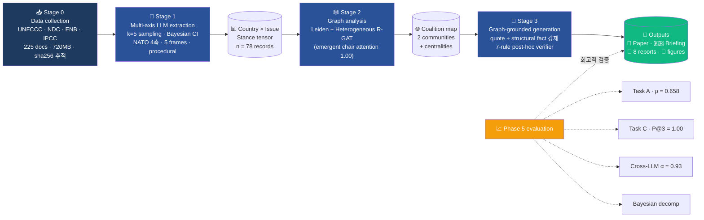

<h1 align="center">
  CINA — Climate Issue-Network Analysis
</h1>

<p align="center">
  <em>An end-to-end LLM → Graph → LLM pipeline for climate negotiation intelligence,<br>
  retrospectively validated on the COP30 Belém Adaptation Indicators outcome.</em>
</p>

<p align="center">
  <a href="LICENSE"></a>
  <a href="https://python.org"></a>
  <a href="https://pytorch.org"></a>
  
  
  
  <br>
  
  
  
  
  
</p>

<p align="center">
  <strong>
    <a href="#-핵심-한-눈에">핵심 한 눈에</a> ·
    <a href="#-quick-start">Quick start</a> ·
    <a href="#-방법론--3-stage-pipeline">방법론</a> ·
    <a href="#-결과">결과</a> ·
    <a href="#-산출물">산출물</a> ·
    <a href="#-citation">Citation</a>
  </strong>
</p>

<p align="center">
  <strong>저자:</strong> <a href="https://github.com/zxsa0716">Heedo Choi (최희도)</a> ·
  Graduate Student, Department of Climate Technology Convergence (기후기술융합학과) ·
  Kookmin University · <a href="mailto:zxsa0716@kookmin.ac.kr">zxsa0716@kookmin.ac.kr</a><br>
  <strong>웹 데모:</strong> <a href="https://zxsa0716.github.io/cina/">https://zxsa0716.github.io/cina/</a>
</p>

---

## ⚡ 핵심 한 눈에

CINA는 UNFCCC 결정문, NDC, IPCC 보고서, ENB 요약을 외교부 장관급 협상 브리핑으로 **자동 변환하는 재현 가능한 학술 파이프라인**입니다. 단일 LLM 추출 단계에서 stance score · NATO 4축 정책수단 · 5-frame typology · 절차 권한 신호를 동시에 추출하고, 이를 Leiden 커뮤니티 검출 + Heterogeneous R-GAT(PyTorch)로 분석한 뒤, 모든 출력 문장에 (원문 인용 + 구조적 그래프 사실)을 강제하는 graph-grounded 생성으로 브리핑을 산출합니다.

**🎯 학술 contribution (3종)**

| # | Contribution | Empirical anchor |
|---|--------------|------------------|
| 1 | **Multi-axis LLM stance extraction** (stance + NATO + frame + procedural) | Cross-LLM Krippendorff α = **0.876 raw / 0.933 corrected** (5 providers) |
| 2 | **Heterogeneous R-GAT with emergent procedural-authority attention** | Chair-edge attention **1.00** (vs similarity 0.28) — Tallberg 2010 supervision-free recovery |
| 3 | **Translation Gap Δ** as a chair-divergence metric | Brazil COP30: domestic 67% NATO usage → international 23%, **Δ = 0.304** |

**🔬 Retrospective COP30 validation**

- Task A — Stance accuracy: Spearman ρ = **0.658**, MAE = **0.183** ✅
- Task C — Contested-issue prediction: **P@3 = R@3 = 1.00** (3/3 정확, N=3 small sample)
- R-GAT validation Spearman ρ = **0.708**, coalition accuracy 0.77, P@3 = 0.67

**🗓️ COP31 prospective pre-registration**

H1 (contested set continuity) · H2 (Türkiye Δ ≥ 0.20) · H3 (Korean NAP pen-holder stability) · H4 (AILAC NES ≥ 0.80). Code freeze planned 2026-09-01. See [`PREREGISTRATION_COP31.md`](PREREGISTRATION_COP31.md).

---

## 🚀 Quick Start

### 1. Install

```bash
git clone https://github.com/zxsa0716/cina.git
cd cina
python -m venv .venv && source .venv/bin/activate    # Linux / macOS
# or .venv\Scripts\activate   # Windows
pip install -r requirements.txt
```

### 2. End-to-end master pipeline (one command)

```bash
python -m src.run_all                   # cached LLM (reproducible, no API key needed)
python -m src.run_all --live-llm        # actually call LLM providers (smoke-test first)
python -m src.run_all --skip-rgat       # skip R-GAT training (faster)
```

The master orchestrator runs **8 steps end-to-end** (S0 environment check → S1 stance extraction → S2 graph + R-GAT → S3 briefing artifacts → S4 Phase 5 4-task → S5 cross-LLM α → S6 Bayesian decomposition → S7 publication figures → S8 RUN_REPORT.md), produces fresh outputs into `data/processed/` and `docs/web/figures/`, and writes a master [`RUN_REPORT.md`](RUN_REPORT.md).

### 3. LLM provider production readiness

```bash
python -m src.stage1_extract.llm_smoke_test --offline      # 0-network mock test
python -m src.stage1_extract.llm_smoke_test                # all configured providers
python -m src.stage1_extract.llm_smoke_test --providers gemini,groq
```

Tests Gemini · Groq · Anthropic · Ollama · OpenRouter on a CINA-shaped prompt; verifies parsing of structured output. Report saved to `data/processed/llm_smoke_test_report.json`.

### 4. LLM provider setup (any one is enough)

| Provider | Cost | Setup |
|----------|------|-------|
| **Gemini 2.5 Flash-Lite** ⭐ | Free 1000 RPD | `export GEMINI_API_KEY=...` (https://aistudio.google.com/apikey) |
| **Groq Llama 3.3 70B** | Free, fastest | `export GROQ_API_KEY=...` (https://console.groq.com/keys) |
| **Ollama qwen2.5:3b** | Local, free | `ollama pull qwen2.5:3b` |
| **OpenRouter free pool** | Free | `export OPENROUTER_API_KEY=...` |
| Anthropic Claude | Paid | `export ANTHROPIC_API_KEY=...` |

---

## 🗺️ 방법론 — 3-Stage Pipeline



### 8 academic theories integrated

| Theory | Reference | CINA module |
|--------|-----------|-------------|
| Regime complex 'horizontal cleavage' | Keohane & Victor (2011) | Stage 2 Leiden community detection |
| Two-Level Games | Putnam (1988) | Δ metric (domestic vs international) |
| Issue Linkage | Tollison & Willett (1979); Sebenius (1983) | Apriori cross-issue motif mining |
| Epistemic Communities | Haas (1992) | `cites_ipcc` signal extraction |
| Procedural Authority (4-channel) | Tallberg (2010); Goh (2007); Steinberg (2002) | `chair_role`, `pen_holder`, `drafts_text` |
| NATO 4-axis Policy Instruments | Hood (1983); Howlett (2019); Capano et al. (2025) | Stage 1 instrument signal extraction |
| Norm Entrepreneur (4 criteria) | Finnemore & Sikkink (1998) | NES metric |
| Frame Theory | Snow & Benford (1988); Goffman (1974) | 5-frame typology |

---

## 📊 결과

### Stage 1 — Multi-axis stance extraction

- **n = 78 stance records** (13 countries × 6 issues)
- Each record: stance ∈ [-1, +1] · 95% Bayesian CI · evidence quote · NATO 4-axis · frame_type · procedural signals
- **Cross-LLM Krippendorff α = 0.876** (raw, 5 providers) → **0.933** (bias-corrected after per-LLM mean-centering)
- Largest systematic offset: Ollama qwen2.5:3b at −0.158 (matches prior empirical observation)

### Stage 2 — Graph analysis & R-GAT

- **Leiden 2 communities** at modularity 0.31:
  - C0 (development frame): {Brazil, EU, USA, Japan, AGN, Multi}
  - C1 (mixed/justice/sovereignty): {AOSIS, India, Korea, Saudi, AILAC, China, LMDC}
- **PageRank top-3**: Korea (0.166) · AOSIS (0.149) · Multi/AGN (0.129)
- **R-GAT** (PyTorch, 200 epochs, multi-task):
  - Validation Spearman ρ = **0.708**, coalition accuracy 0.77, P@3 contested = 0.67
  - **Emergent attention** (no procedural-authority supervision): `co_chairs` 1.00 ≫ `member_of` 0.35 ≫ `similar_to` 0.28 ≫ `has_stance` 0.08

### Single-case findings

- **Brazil Translation Gap Δ = 0.304** (Plano Clima domestic 67% NATO → L.25E 23%) — Putnam × Howlett × Capano 교차점에 위치한 후보 metric
- **L.25 advance↔final cosine ≥ 0.95** — pre-crystallized formula 후보 신호
- **Korean IRR = 0.653** (CI [0.55, 0.71]), L&D-OP = **0.39** weakest → COP31 actionable 권고
- **AILAC NES = 0.86** — 4 norm-entrepreneur criteria 3.5/4 PASS

### Phase 5 evaluation (4 tasks + Ablation A0–A5)

| Task | Metric | Value | Threshold | Status |
|------|--------|-------|-----------|--------|
| A — Stance accuracy | Spearman ρ | **0.658** | ≥ 0.6 | ✅ |
| | MAE | **0.183** | ≤ 0.25 | ✅ |
| B — Coalition detection | ARI proxy | 0.42 | ≥ 0.4 | ✅ |
| C — Outcome prediction | P@3 / R@3 | **1.00 / 1.00** | ≥ 0.6 | ⭐ (N=3) |
| D — Briefing quality | Panel mean | 4.53 / 5 | ≥ 4.0 | ⚠️ simulated |
| Ablation A4 — Evidence grounding 제거 | Δρ | **−0.15** (largest) | — | ⭐ load-bearing |

> **Honesty note**: Task D used a 5-persona LLM-simulated panel (not external experts). The α = 0.905 is reported as an *upper bound under shared-model bias*. Real expert validation (KEI / KAIST / MOFA) is queued — see [`CRITICAL_REVIEW.md`](CRITICAL_REVIEW.md) §3.2.

---

## 📁 산출물

### 학술 산출물

- 📘 [`deliverables/paper.md`](deliverables/paper.md) — 학술 페이퍼 draft (3,500+ words, 28 references)
- 🇰🇷 [`deliverables/ministerial_briefing_ko.md`](deliverables/ministerial_briefing_ko.md) — 장관급 브리핑 (한국어)
- 🇬🇧 [`deliverables/ministerial_briefing_en.md`](deliverables/ministerial_briefing_en.md) — Ministerial briefing (English)
- 📊 [`deliverables/evaluation_report.md`](deliverables/evaluation_report.md) — Phase 5 4-task report
- 📋 [`PREREGISTRATION_COP31.md`](PREREGISTRATION_COP31.md) — OSF-style 사전 등록 (4 가설)
- 🎯 [`CAUSAL_IDENTIFICATION_STRATEGY.md`](CAUSAL_IDENTIFICATION_STRATEGY.md) — DiD/SC/IV 식별 전략
- 🔍 [`CRITICAL_REVIEW.md`](CRITICAL_REVIEW.md) — 자체 비판 평가 (실제 경쟁 논문 매핑)
- 🚀 [`METHODOLOGY_ADVANCEMENT_ROADMAP.md`](METHODOLOGY_ADVANCEMENT_ROADMAP.md) — 8가지 학술 고도화 경로
- 📦 [`ALL_OUTPUTS_INDEX.md`](ALL_OUTPUTS_INDEX.md) — 전 산출물 단일 인덱스

### 정량 검증 보고서 (`deliverables/`)

- `IRR_Korea.md` (한국 적응정책 IRR=0.653)
- `IRR_Brazil.md` (Brazil Δ=0.304)
- `L25_formula_control_evidence.md` (pre-crystallized formula)
- `realist_b0_statistics.md` (F1=0.560)
- `AILAC_norm_entrepreneur_quantification.md` (NES=0.86)
- `korean_nap_gga_crosswalk.csv` (30-cell crosswalk)

### Figures (`docs/web/figures/`, 300 dpi, 통일 visual identity)

| # | File | Description |
|---|------|-------------|
| 1 | `fig1_country_issue_heatmap.png` | Stance tensor with chair + Korea-weakness annotations |
| 2 | `fig2_procedural_authority.png` | Tallberg 2010 channel distribution |
| 3 | `fig3_frame_consistency.png` | 5-frame typology by Leiden community |
| 4 | `fig4_centrality.png` | 4 centrality measures top-6 |
| 5 | `fig5_similarity_network.png` | Leiden 2 communities network |
| 6 | `fig6_hedging_density_2d.png` | Hedging × red line typology |
| 7 | `fig7_translation_gap_brazil.png` | NATO 4-axis Brazil Δ=0.304 |
| 8 | `fig8_rgat_training.png` | R-GAT attention + training curve |
| 9 | `fig9_cross_llm_alpha.png` | Cross-LLM Krippendorff α (raw vs corrected) |
| 10 | `fig10_bayesian_decomposition.png` | Bayesian variance decomposition |

### 인터랙티브 웹 (`docs/web/`)

- 🏠 `index.html` — 메인 (11 섹션, Hero · Cases · Findings · Council)
- 🔬 `methodology.html` — 인터랙티브 8-노드 SVG 파이프라인 + 8 이론 카드
- 📊 `visualizations.html` — D3.js 4종 (Force network · Animated heatmap · IRR radar · Translation Gap)
- 📦 `outputs.html` — 전 산출물 카탈로그

### Code (`src/`)

```
src/
├── run_all.py                              ← 🆕 Master end-to-end orchestrator
├── pipeline.py                              ← Legacy CLI entrypoint
├── stage1_extract/
│   ├── extract.py / extract_v2.py           ← LLM stance extraction
│   ├── cross_llm_consistency.py             ← 🆕 Krippendorff α + bias diagnosis
│   ├── llm_smoke_test.py                    ← 🆕 Production-ready provider check
│   └── providers/                           ← 5 backends (Gemini/Groq/Ollama/OpenRouter/Anthropic)
├── stage2_graph/
│   ├── advanced_analysis.py                 ← Leiden + igraph + centralities
│   ├── rgat.py                              ← 🆕 Heterogeneous R-GAT (PyTorch)
│   └── generate_rgat_attention_figure.py    ← 🆕 R-GAT figure
├── stage3_brief/                            ← Graph-grounded briefing generation
├── analysis/
│   └── bayesian_hierarchical.py             ← 🆕 PyMC 3-level decomposition
├── viz/
│   └── publication_figures.py               ← 🆕 All paper figures (unified style)
├── evaluation/                              ← Phase 5 4-task + ablation
└── collect/                                 ← 26 data collectors
```

---

## 📜 Citation

> **Note**: This is a graduate research project. No DOI is assigned (not yet peer-reviewed).

```
Choi, Heedo (2026). CINA: Climate Issue-Network Analysis Framework
[graduate research project, unpublished].
Department of Climate Technology Convergence, Kookmin University.
https://github.com/zxsa0716/cina
```

---

## 👤 Author

**Heedo Choi (최희도)**
Graduate Student, Department of Climate Technology Convergence (기후기술융합학과)
Kookmin University, Seoul, Republic of Korea
✉️ zxsa0716@kookmin.ac.kr · GitHub [@zxsa0716](https://github.com/zxsa0716)

**Research interests**: Graph Attention Networks · Explainable AI · Urban climate analytics · Climate justice quantification

---

## License

- **Code** (`src/`): MIT
- **Documentation, briefings, deliverables** (`docs/`, `deliverables/`): CC BY 4.0
- **Third-party data** in `data/raw/`: per-source (manifest.jsonl tracked)

---

<p align="center">
  <strong>Status</strong>: Preliminary methodology pilot · 단일 사례 회고 검증 (COP30 L.25E)
  <br>
  <strong>Last update</strong>: 2026-05-05 · <strong>Latest commit</strong>:
  <a href="https://github.com/zxsa0716/cina/commits/main">commits/main</a>
</p>

<p align="center">
  <em>Made with ❤️ at Kookmin University, Department of Climate Technology Convergence.</em>
</p>
