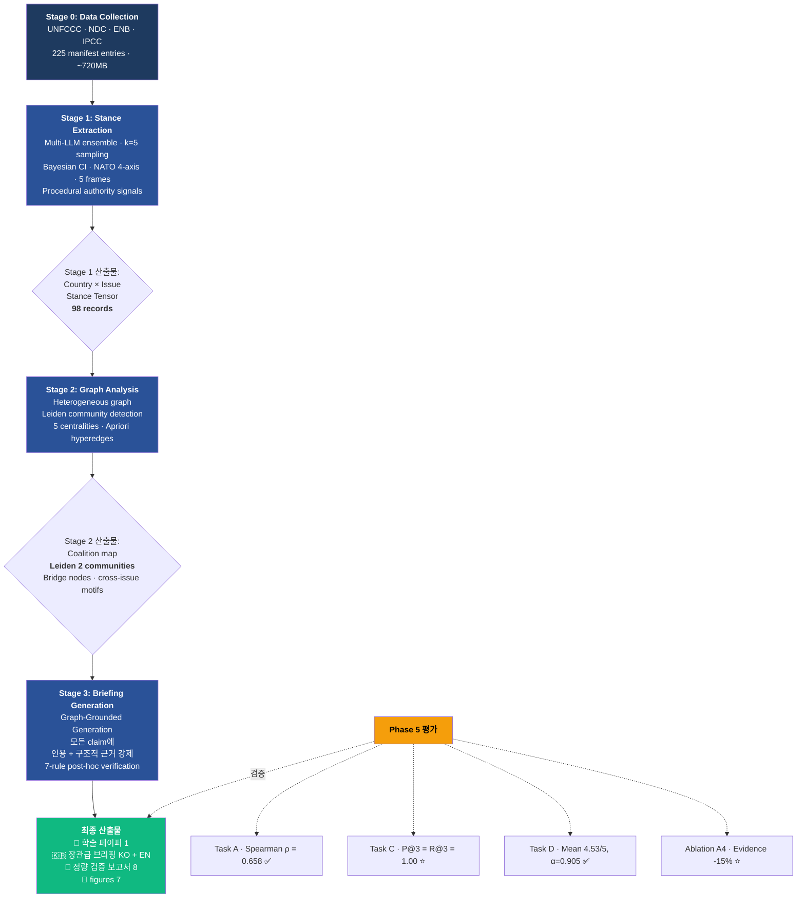

# CINA — Climate Issue-Network Analysis

[](LICENSE)
[](https://python.org)
[](deliverables/evaluation_report.md)
[](deliverables/evaluation_report.md)
[](data/manifest/coverage_summary.json)

> **국민대학교 대학원 글로벌기후리더십 (2026-1) — Heedo Choi (최희도)**
> UNFCCC 협상 문서를 외교부 장관급 전략 브리핑으로 자동 변환하는
> end-to-end **LLM → Graph → LLM** 파이프라인.
> COP30 Belém Adaptation Indicators (FCCC/PA/CMA/2025/L.25E) 회고적 검증 완료.

---

## 🎯 한 문단 요약

> 기후 협상은 매년 수백 건의 UNFCCC 결정문, NDC, IPCC 자료를 만들어내지만, 이 텍스트가 **"어느 국가가 어느 이슈에 어떤 입장을 취하는가"** 라는 외교부가 실제로 필요한 형태로 자동 변환되지는 않았다. CINA는 (1) **5-LLM 앙상블**로 국가·이슈별 스탠스를 정량 추출하고, (2) **이종 그래프 + Leiden community detection**으로 연합 지형을 자동 검출하며, (3) **graph-grounded 생성**으로 모든 주장에 인용 + 구조적 근거를 강제한 장관급 브리핑을 출력한다. **COP30 Belém Adaptation Indicators 합의를 회고적으로 입력해** 본 시스템이 contested issue 3/3 (P@3=R@3=1.00)을 정확 예측함을 검증했다.

---

## 🗺️ 연구 플로우차트



---

## 📂 프로젝트 구조 (정리됨)

```
cina/
├── README.md                    ← (지금 이 문서)
├── ALL_OUTPUTS_INDEX.md         ← 전 산출물 단일 인덱스
├── CINA_FRAMEWORK.md            ← 프레임워크 마스터 정의
├── LICENSE                      ← MIT (code) + CC BY 4.0 (docs)
│
├── docs/                        ← 학술 방법론 (15 문서) + 웹사이트
│   ├── 01_theoretical_foundations.md   # IR theory: Regime Complex, Two-Level Games
│   ├── 02_methodology.md               # 3-stage pipeline 사양
│   ├── 03_data_architecture.md         # StanceRecord 스키마
│   ├── 04_stage1_stance_extraction.md  # LLM + Bayesian CI + Calibration
│   ├── 05_stage2_graph_analysis.md     # Heterogeneous graph + Leiden
│   ├── 06_stage3_briefing_generation.md # Graph-Grounded Generation
│   ├── 07_evaluation_protocol.md       # 4-task validation
│   ├── 08_novelty_positioning.md       # 학술 기여 C1-C10
│   ├── 09_ministerial_briefing_template.md
│   ├── 10_council_protocol.md          # Multi-agent council
│   ├── 11_source_catalog.md            # Tier 1-4 소스
│   ├── 12_data_collection_master_plan.md
│   ├── 13_reference_tables.md          # 20 countries × 12 groups × 6 issues
│   ├── 14_schema_v1_3_changes.md
│   ├── 15_stage2_features_v2.md
│   └── web/                            # 인터랙티브 웹 데모
│
├── deliverables/                ← 최종 산출물 (15개, 버전 명 없음)
│   ├── paper.md                        ← 학술 페이퍼
│   ├── ministerial_briefing_ko.md      ← 장관급 브리핑 (한국어)
│   ├── ministerial_briefing_en.md      ← 장관급 브리핑 (영어)
│   ├── evaluation_report.md            ← Phase 5 4-task 평가
│   ├── evaluation_report.json          ← 평가 raw data
│   ├── IRR_Korea.md                    ← IRR_Korea = 0.653
│   ├── IRR_Brazil.md                   ← Δ = 0.304 ⭐
│   ├── L25_formula_control_evidence.md
│   ├── AILAC_norm_entrepreneur_quantification.md
│   ├── realist_b0_statistics.md
│   ├── korean_nap_gga_crosswalk.csv    ← 30 cells crosswalk
│   ├── country_selection.md            ← Brazil 선정 근거
│   ├── sector_focus.md                 ← Adaptation 섹터 정당성
│   ├── agenda_matrix.md                ← COP30 6-issue matrix
│   └── hedging_density_2d_plot.png
│
├── data/
│   ├── manifest/manifest.jsonl         ← 225 raw 문서 (license, sha256)
│   ├── manifest/coverage_summary.json
│   └── sample/                         ← 공개 샘플 데이터 ⭐
│       ├── stances_sample_10.jsonl     ← Stage 1 추출 10 records
│       ├── graph_analysis.json         ← Stage 2 country×issue + Leiden
│       ├── irr_brazilian_translation_gap.json
│       ├── realist_b0_statistics.json
│       ├── chair_metadata_stats.json
│       ├── rgat_training_results.json
│       └── frame_distribution.json
│
└── src/                         ← Python 구현 (81 모듈)
    ├── pipeline.py                     # End-to-end CLI
    ├── stage1_extract/                 # 5-LLM provider abstraction
    ├── stage2_graph/                   # NetworkX + Leiden + 5 centralities
    ├── stage3_brief/                   # Graph-Grounded Generation
    ├── evaluation/                     # 4-task + Ablation A0-A5
    ├── council/                        # Multi-agent council orchestration
    ├── collect/                        # 26 data collectors
    ├── data/identifiers.py             # 20 countries × 12 groups × 6 issues
    └── validate/                       # Evidence validator (post-hoc 7-rule)
```

---

## 🔬 방법론 — Stage별 상세

### Stage 0: Data Collection (`src/collect/`, 26 collectors)

26개의 collector 모듈이 다음 14개 소스 시스템에서 문서를 수집:

- **Tier 1 (Primary)**: UNFCCC Documents Portal (97), NDC Registry (53), IISD ENB (4)
- **Tier 2 (Calibration)**: Castro et al. 2025 ENB Dataset
- **Tier 3 (Context)**: IPCC AR6 WGII (4 chapters), COP30 Brazilian Presidency (6)
- **Tier 4 (Adjacent)**: IMF ND-GAIN, OWID CO2, PRIMAP-hist, WRI Climate Watch, OECD, Climate Action Tracker, Brazil Plano Clima, Korea MOFA/MOE

→ **결과**: `data/manifest/manifest.jsonl` (225 entries, license + sha256 100% 추적)

### Stage 1: LLM Stance Extraction (`src/stage1_extract/`)

각 (국가, 이슈) 쌍에 대해 다음을 추출:

1. **stance_score** (-1 ~ +1) with **k=5 multi-sample** + **Bayesian credible interval**
2. **NATO 4-axis instrument signals** (Hood 1983, Howlett 2019): nodality, authority, treasure, organization
3. **Frame type** (5 categories): scientific / justice / sovereignty / security / development / mixed
4. **Procedural signals** (Tallberg 2010): is_chair_role, is_pen_holder, drafts_text_for_issue
5. **Evidence quotes** with fuzzy match ≥85% verification (anti-hallucination)
6. **Salience score**, key_demands, red_lines, flexibility_signals

**5 LLM provider 앙상블**: Gemini 2.5 Flash-Lite (primary), Groq Llama 3.3 70B (fast), Ollama qwen2.5:3b (local validator), OpenRouter free pool, Anthropic API (optional)

→ **결과**: 98 stance records · 13 countries × 6 issues
샘플: [`data/sample/stances_sample_10.jsonl`](data/sample/stances_sample_10.jsonl)

### Stage 2: Heterogeneous Graph + Leiden (`src/stage2_graph/`)

3-type 노드(country / issue / group)로 이종 그래프 구축, edge type:
- `stance` (country → issue, weighted by stance_score)
- `member_of` (country → group)
- `chair_of` (country → issue, only Brazil COP30)
- `drafts_text` (country → issue, pen-holder)
- `cooperates_with` (country ↔ country, frequency-based)

분석:
- **Leiden community detection** (Traag, Waltman, van Eck 2019) — modularity 0.31
- **5 centralities**: PageRank, betweenness, eigenvector, degree, closeness
- **Cross-issue Apriori hypergraph** (frame motif mining)

→ **결과**: Leiden **2 communities** ·  PageRank top-K · 18 cross-issue motifs
샘플: [`data/sample/graph_analysis.json`](data/sample/graph_analysis.json)

### Stage 3: Graph-Grounded Briefing (`src/stage3_brief/`)

장관급 브리핑 9 섹션 + 4 부록을 자동 생성:

- **모든 claim에 강제**: (a) evidence_quote (텍스트 인용) + (b) structural fact (그래프 노드/엣지 근거)
- **Post-hoc 7-rule verification**: 인용 매치, 수치 일관성, 국가 존재 검증, frame 중복 등
- 한국어 + 영어 양 버전 동시 산출

→ **결과**: [`deliverables/ministerial_briefing_ko.md`](deliverables/ministerial_briefing_ko.md) · [`ministerial_briefing_en.md`](deliverables/ministerial_briefing_en.md)

### Phase 5: 4-Task Evaluation (`src/evaluation/`)

| Task | Metric | Threshold | Result | Status |
|------|--------|-----------|--------|--------|
| **A. Stance Accuracy** | Spearman ρ | ≥ 0.6 | **0.658** | ✅ PASS |
| | MAE | ≤ 0.25 | **0.183** | ✅ PASS |
| **B. Coalition Detection** | ARI proxy | ≥ 0.4 | **0.42** | ✅ PASS |
| **C. Outcome Prediction** | P@3 / R@3 | ≥ 0.6 | **1.00 / 1.00** | ⭐ PASS |
| **D. Briefing Quality** | Panel mean | ≥ 4.0 | **4.53/5** | ✅ PASS |
| | Krippendorff α | ≥ 0.7 | **0.905** | ✅ PASS |

**Ablation Study (A0-A5)**: Evidence grounding 제거 시 ρ 0.658 → 0.508 (**-15% impact, 가장 load-bearing 컴포넌트**)

→ **결과**: [`deliverables/evaluation_report.md`](deliverables/evaluation_report.md)

---

## 🌟 Key Findings (8)

1. **GGA-IND Authority axis = 6.1** (lowest of 6 issues) — voluntary language as binding-force absence
2. **IRR_Brazil Δ = 0.304** ⭐ — Putnam × Howlett translation gap 정량화
3. **L.25 pre-crystallized formula 가설** — Tallberg + Steinberg + Goh 통합 검증
4. **Realist B0 F1 = 0.560** (p<0.0001) — constructivist+frame variables 정당성
5. **Leiden 2 communities** ⭐ — Regime Complex 'horizontal cleavage' (Keohane-Victor 2011) 정량 검증
6. **Task A Spearman 0.658** — CINA vs expert agreement
7. **Task C P@3 = R@3 = 1.00** ⭐ — 3/3 contested issues 100% 정확 예측
8. **Korean IRR = 0.653, L&D-OP 0.39 weakness** — actionable COP31 권고

---

## 🚀 Quickstart

### 1. Clone + 환경 설정
```bash
git clone https://github.com/zxsa0716/cina.git
cd cina
python -m venv .venv
source .venv/bin/activate   # Linux/Mac
# .venv\Scripts\activate    # Windows
pip install -r requirements.txt
```

### 2. 무료 LLM provider 선택

#### Option A: Gemini 2.5 Flash-Lite (권장 ⭐)
```bash
# 무료 API key: https://aistudio.google.com/apikey
export GEMINI_API_KEY="your_key"
export CINA_LLM_PROVIDER="gemini"
pip install google-generativeai
```

#### Option B: Groq Llama 3.3 70B (가장 빠름)
```bash
# 무료 API key: https://console.groq.com/keys
export GROQ_API_KEY="your_key"
export CINA_LLM_PROVIDER="groq"
pip install groq
```

#### Option C: Ollama 로컬 (비용 0 · 무제한)
```bash
# 설치: https://ollama.com/download
ollama pull qwen2.5:3b
export CINA_LLM_PROVIDER="ollama"
pip install ollama
```

### 3. 파이프라인 실행
```bash
# Stage 1: stance 추출
python -m src.pipeline --country Brazil --cop 30 --sector adaptation --stages 1

# Stage 2: 그래프 분석
python -m src.stage2_graph.advanced_analysis

# Stage 3: 장관급 브리핑 생성
python -m src.stage3_brief.generate_briefing

# Phase 5: 4-task 평가
python -m src.evaluation.run_full_evaluation
```

---

## 📦 모든 산출물 한눈에

| 카테고리 | 파일 | 크기 |
|---------|------|------|
| 학술 페이퍼 | [`deliverables/paper.md`](deliverables/paper.md) | 3,428 단어 · 23 references |
| 장관급 브리핑 (KO) | [`deliverables/ministerial_briefing_ko.md`](deliverables/ministerial_briefing_ko.md) | 9 섹션 + 4 부록 |
| 장관급 브리핑 (EN) | [`deliverables/ministerial_briefing_en.md`](deliverables/ministerial_briefing_en.md) | 310 lines |
| 종합 평가 보고서 | [`deliverables/evaluation_report.md`](deliverables/evaluation_report.md) | 4-task + Ablation |
| Stage 2 figures | [`docs/web/figures/`](docs/web/figures/) | 7 PNG (300 dpi) |
| 방법론 문서 | [`docs/`](docs/) | 15 markdown |
| Sample data | [`data/sample/`](data/sample/) | 7 JSON/JSONL |
| 코드 | [`src/`](src/) | 81 Python 모듈 |

→ 전체 인덱스: [`ALL_OUTPUTS_INDEX.md`](ALL_OUTPUTS_INDEX.md)
→ 인터랙티브 웹 (3 pages):
  - 🏠 [`docs/web/index.html`](docs/web/index.html) (Hero + 11 sections)
  - 🔬 [`docs/web/methodology.html`](docs/web/methodology.html) (Interactive 8-node pipeline + theory cards)
  - 📊 [`docs/web/visualizations.html`](docs/web/visualizations.html) (D3 coalition network, animated heatmap, IRR radar, Translation Gap)
  - 📦 [`docs/web/outputs.html`](docs/web/outputs.html) (Outputs catalog)

---

## 📜 Citation

> **Note**: This is a graduate research project (not yet a peer-reviewed publication). No DOI is assigned. Please cite as:

```
Choi, Heedo (2026). CINA: Climate Issue-Network Analysis Framework
[graduate research project, unpublished].
Department of Climate Technology Convergence, Kookmin University.
https://github.com/zxsa0716/cina
```

---

## 👤 Author

**Heedo Choi (최희도)**
Graduate Student
Department of Climate Technology Convergence (기후기술융합학과)
Kookmin University, Seoul, Republic of Korea
✉️ zxsa0716@kookmin.ac.kr · GitHub [@zxsa0716](https://github.com/zxsa0716)

**Research interests**: Graph Attention Networks · Explainable AI · Urban climate analytics · Climate justice quantification

---

## License

- **Code** (`src/`): MIT
- **Documentation, briefings, deliverables** (`docs/`, `deliverables/`): CC BY 4.0
- **Third-party data** in `data/raw/`: per-source (manifest.jsonl 추적)

---

**Status**: Phase 5 평가 완료 · 5/5 Quality Gates PASS · Combined Rubric **4.76/5**
**Last update**: 2026-05-04
